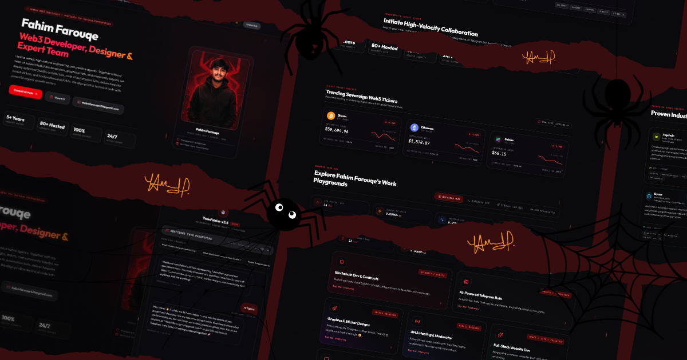

<div align="center">

# Fahim — Web3 Developer & Designer Portfolio

**Premium Web3 Developer, Designer & AMA Host.**

[](https://www.amifahim.tech)
[](https://github.com/amifahim404)
[](https://www.linkedin.com/in/fahim-farouqe-b3ba38248/)
[](https://x.com/Fahim_farouqe)
[](https://t.me/FAHIM888)
[](https://discord.com/users/fahim4978)
[](https://render.com)

[](mailto:fahimfarouqe424@gmail.com)




</div>

> 📎 All social links and contact info are in the badges above and the Contact section below.

---

## About

Personal portfolio of **Fahim** — Web3 developer, designer, and AMA host. Built as a fully interactive single-page application with a secure AI-powered chatbot twin, live crypto data, and a handful of developer-flavored sandbox toys instead of a static resume page.

Live at **[amifahim.tech](https://www.amifahim.tech)**.

---

## 🌟 Feature Highlights

- **Consolidated Intake Hub** — Interactive action buttons with custom color tuning for proper contrast in both slate light mode and dark crimson mode.
- **Advanced AI Twin Chatbot** (`AIChatBot.tsx`) — Server-side OpenRouter integration that keeps API keys off the client, with automatic fallback model selection to stay responsive under load.
- **Perfect Aesthetic Scrollbars** — Lightweight custom scroll tracks that adapt to the active theme, no default browser scrollbar look.
- **Custom Precision Trailing Cursor** (`CustomCursor.tsx`) — Physics-based trailing cursor ring for desktop.
- **Creative Developer Sandbox** — Sticker Canvas Playground, live Crypto Price Feed, Solidity Smart Contract Terminal, and AMA Q&A Stages.

---

## Tech Stack

| Layer | Technology | Purpose |
|:------|:-----------|:--------|
| Framework | React + TypeScript | UI architecture and type-safe components |
| Build Tool | Vite | Fast bundling and hot module replacement |
| Server | Express (`server.ts`) | Serves the app and proxies AI chat requests server-side |
| AI | OpenRouter + Gemini (fallback) | Powers the AI Twin Chatbot |
| Deployment | Render | Web service hosting on custom domain |
| DNS | get.tech | Domain management for amifahim.tech |

---

## ⚙️ Setup

### 1. Environment Variables

Create a `.env` file at the project root:

```env
# Server Ingress Port
PORT=3000

# OpenRouter Configuration for the AI Twin
OPENROUTER_API_KEY=your_openrouter_key_here
OPENROUTER_MODEL=nvidia/nemotron-3-nano-30b-a3b:free

# Google Gemini API key (fallback support)
GEMINI_API_KEY=your_gemini_key_here
```

`.gitignore` already excludes `.env*`, so keys never get pushed.

### 2. Run Locally

```bash
# Install dependencies
npm install

# Start the interactive full-stack dev environment
npm run dev

# Compile static assets and bundle the Express server
npm run build

# Boot the production container
npm start
```

Open **http://localhost:3000** and confirm the chatbot responds before deploying.

---

## 🚀 Deploy

### Push to GitHub

```bash
git add .
git commit -m "Your commit message"
git push origin main
```

### Render

1. [render.com](https://render.com) → sign in with GitHub
2. **New → Web Service** → select the repo
3. Settings:
   - **Build Command:** `npm install && npm run build`
   - **Start Command:** `npm start`
4. Environment variables: `OPENROUTER_API_KEY`, `OPENROUTER_MODEL`, `GEMINI_API_KEY`, `NODE_ENV=production`
5. **Create Web Service** → Render builds and provides a live `.onrender.com` URL

Auto-deploy triggers on every push to `main` by default.

### DNS (get.tech → Render)

| Record | Host | Value |
|:-------|:-----|:------|
| CNAME | `www` | `<your-service>.onrender.com` |
| ALIAS/ANAME (or A if unsupported) | `@` | `<your-service>.onrender.com` (or Render's static IP) |

Delete any default parking records on `@`/`www` before adding these, then verify the custom domain in the Render dashboard.

---

## SEO

- `robots.txt` and `sitemap.xml` live in `public/` and are served from the site root
- Google Search Console verified via HTML file method
- Open Graph + Twitter Card meta tags point to `https://www.amifahim.tech`

---

## Project Structure

```
src/
├── components/
│   ├── AIChatBot.tsx
│   ├── AMAModeratorStage.tsx
│   ├── AnimatedCounter.tsx
│   ├── BackgroundEffect.tsx
│   ├── BattlePlan.tsx
│   ├── ContactFormBox.tsx
│   ├── CryptoPriceFeed.tsx
│   ├── CustomCursor.tsx
│   ├── HeroSection.tsx
│   ├── ServiceHub.tsx
│   ├── SolidityTerminal.tsx
│   ├── StickerPlayground.tsx
│   ├── ThemeAssetPreloader.tsx
│   ├── Toast.tsx
│   └── WorkExperience.tsx
├── App.tsx
├── main.tsx
└── types.ts
server.ts
```

---

## Contact

- 📧 [fahimfarouqe424@gmail.com](mailto:fahimfarouqe424@gmail.com)
- 🐙 [github.com/amifahim404](https://github.com/amifahim404)
- 💼 [linkedin.com/in/fahim-farouqe-b3ba38248](https://www.linkedin.com/in/fahim-farouqe-b3ba38248/)
- 🐦 [x.com/Fahim_farouqe](https://x.com/Fahim_farouqe)
- 💬 [Telegram — @FAHIM888](https://t.me/FAHIM888)
- 🎮 [Discord — fahim4978](https://discord.com/users/fahim4978)
- 🌐 [amifahim.tech](https://www.amifahim.tech)
